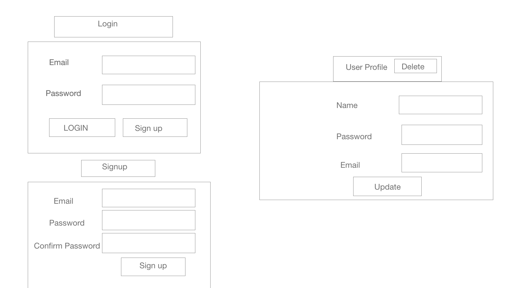
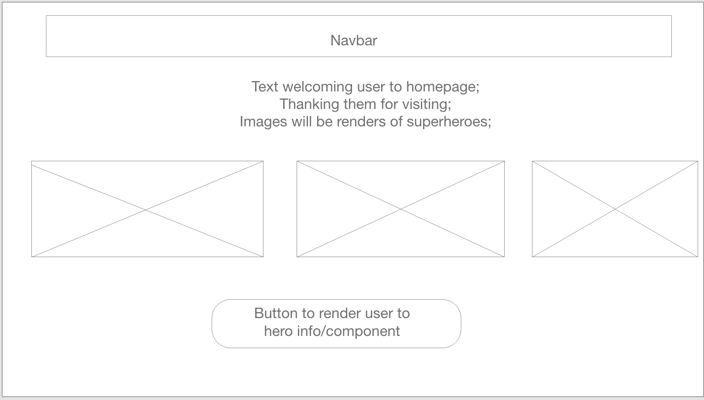
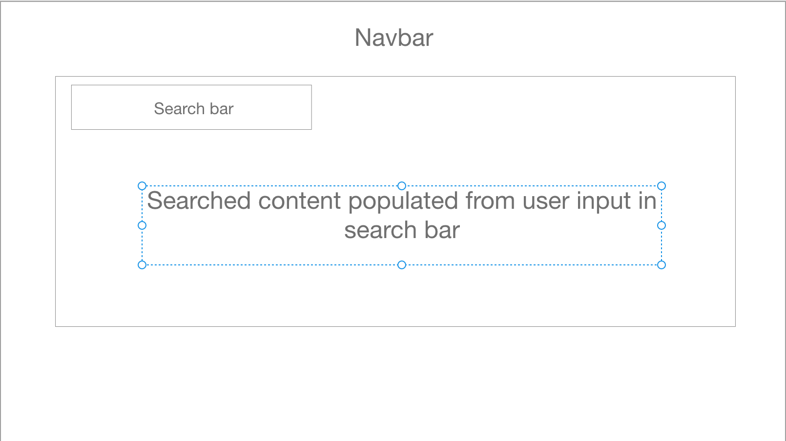

## MIN REQUIREMENTS 

<<<<<<< HEAD
 Project has Instructor approval at the start of project week - Completed
=======
 Project has Instructor approval at the start of project week - Completed 
>>>>>>> master

 Project code is pushed to a public Git repository - Completed 

 Project planning board used throughout project - Completed 

 ReactJS is used for frontend development- Completed

 Uses CSS or styled components to style application- Completed

 App renders in browser- Completed

<<<<<<< HEAD
 Uses a 3rd party api - https://www.potterapi.com/v1/characters 
=======
 Uses a 3rd party api - https://www.potterapi.com/v1/characters
>>>>>>> master
 ## Link to deployed website
 
 ["Herosite"](https://herosite-60fd9.web.app)

 Project is deployed using 1 of the deployment options(heroku, surge, aws or firebase - Completed

Must contain a readme file at the root of the repository - Completed

 Git repo has at least 30 git commit - Completed 

 Has readme.md file at the root of repository - Completed 

 App should be able to use CRUD in some form - Completed

 readme file clearly documents the purpose of the project as a problem statement
<<<<<<< HEAD
 >Purpose of project is to have user make account, in doing so they get access to Harry Potter information through 3rd party api to learn more about characters, spells, houses, etc.

 readme file clearly documents the target end user for this program.
 >Due to pandemic, we are making this application for anyone home (which is everyone lol), to have fun and let loose and remember the good times before Harry Potter finished. 
=======
 >Purpose of project is to have user make account, in doing so they get access to Harry Potter information through 3rd party api to learn more about them.

 readme file clearly documents the target end user for this program.
 >Due to pandemic, we are making this application for anyone home (which is everyone lol), to have fun and let loose and remember the good times when before Harry Potter finished.  
>>>>>>> master

 readme file has embedded link (not url) to publicly deployed app

 readme file includes image to wireframes - Completed 
 
 ### Link to deployed website
 
 ["Herosite"](https://herosite-60fd9.web.app)

### Login page 
 
 ### Home page
  
  ### Hero page 
   

This project was bootstrapped with [Create React App](https://github.com/facebook/create-react-app).

## Available Scripts

In the project directory, you can run:

### `npm start`

Runs the app in the development mode. 
Open [http://localhost:3000](http://localhost:3000) to view it in the browser.

The page will reload if you make edits. 
You will also see any lint errors in the console.

### `npm test`

Launches the test runner in the interactive watch mode. 
See the section about [running tests](https://facebook.github.io/create-react-app/docs/running-tests) for more information.

### `npm run build`

Builds the app for production to the `build` folder. 
It correctly bundles React in production mode and optimizes the build for the best performance.

The build is minified and the filenames include the hashes. 
Your app is ready to be deployed!

See the section about [deployment](https://facebook.github.io/create-react-app/docs/deployment) for more information.

### `npm run eject`

**Note: this is a one-way operation. Once you `eject`, you can’t go back!**

If you aren’t satisfied with the build tool and configuration choices, you can `eject` at any time. This command will remove the single build dependency from your project.

Instead, it will copy all the configuration files and the transitive dependencies (webpack, Babel, ESLint, etc) right into your project so you have full control over them. All of the commands except `eject` will still work, but they will point to the copied scripts so you can tweak them. At this point you’re on your own.

You don’t have to ever use `eject`. The curated feature set is suitable for small and middle deployments, and you shouldn’t feel obligated to use this feature. However we understand that this tool wouldn’t be useful if you couldn’t customize it when you are ready for it.

## Learn More

You can learn more in the [Create React App documentation](https://facebook.github.io/create-react-app/docs/getting-started).

To learn React, check out the [React documentation](https://reactjs.org/).

### Code Splitting

This section has moved here: https://facebook.github.io/create-react-app/docs/code-splitting

### Analyzing the Bundle Size

This section has moved here: https://facebook.github.io/create-react-app/docs/analyzing-the-bundle-size

### Making a Progressive Web App

This section has moved here: https://facebook.github.io/create-react-app/docs/making-a-progressive-web-app

### Advanced Configuration

This section has moved here: https://facebook.github.io/create-react-app/docs/advanced-configuration

### Deployment

This section has moved here: https://facebook.github.io/create-react-app/docs/deployment

### `npm run build` fails to minify

This section has moved here: https://facebook.github.io/create-react-app/docs/troubleshooting#npm-run-build-fails-to-minify
